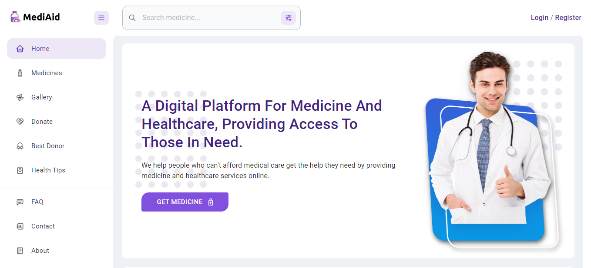
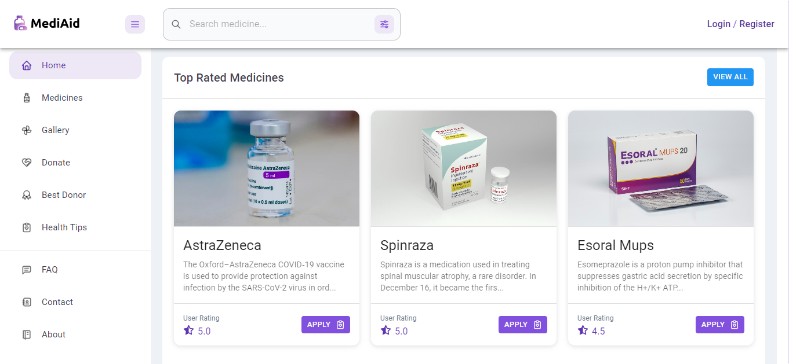

  
  

 

Welcome to the MediAid project repository! This project aims to provide a platform for individuals and organizations to donate unused or unexpired medicines to those in need. By donating medicines, you can help reduce healthcare costs and improve access to essential medications for people who cannot afford them.

## Getting Started

### Developer guide
- Clone the project in your local machine
- Install all the the dependencies. (client and server)
- Rename the default.env file in both directories and configure it.
- Use `cd client` then `npm run dev` to run your client
- Use `cd server` then `npm run serve` to run your server

Admin email: mediaid-admin@gmail.com 
Admin password: 123456789

### User guide

To get started with donating medicines, please follow these steps:

1. Check the expiration date: Make sure that the medicines you wish to donate have not expired or are close to expiring.

2. Sort and package the medicines: Sort the medicines into separate bags or boxes according to their type (e.g., painkillers, antibiotics, etc.). Label each bag/box with the name of the medicine and the expiration date.

3. Apply for the donation in our platform with proper documents and images.

4. If it meets our requirements we will accept your gratitude.

## Contributing

We welcome contributions to this project in the form of code, documentation, or financial support. If you are interested in contributing, please see our [CONTRIBUTING.md](CONTRIBUTING.md) file for guidelines.

## License

This project is licensed under the [MIT License](LICENSE).

## Contact

If you have any questions or suggestions, please feel free to reach out to us at sharif35-3001@diu.edu.bd or asiful35-2961@diu.edu.bd. Thank you for your interest in donating medicines and helping to improve access to healthcare for all.
